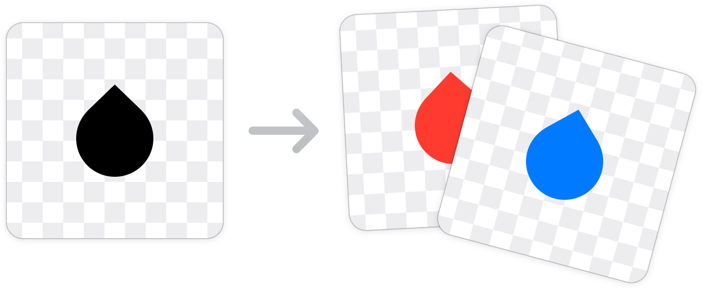

# Tinto
Apply tint color to web images, on the fly.

# Usage
First, create a Tinto object using an image **template**. Usually this is a DOM element in your interface. Then finally *(yes, there isn't much else to it)*, use this object to generate tinted images as you need them.

In the following example an `` contents are tinted:

```js
// The element we want to use as a template. This is an .
var element = document.getElementById('img-ui-element');

// Create a Tinto from `element`. This object can tint new images.
var tinto = new Tinto(element);

// Update `src` so it displays a tinted image. 
element.src = tinto.imageDataWithTintColor('#FF404C');
```

A template image can also be created from an **URL**. This is particullary useful if you're dealing with server images from a data model. Tinted images can be created from the completion callback.

```js
var imageURL = 'http://example.foo/image.png';

Tinto.fromURL(imageURL, function(tinto){
    // Create a new tinted image
	var imageWithColor = tinto.imageDataWithTintColor('#FF404C');
	
	// ...assume `element` is an  on your interface...
	element.src = imageWithColor;
});
```
# Reference
Public methods are listed as follows. Don't forget to check the [example](Example.html) to see Tinto in action.

## Factory methods
- **Tinto.fromURL(URL, callback)**.
Begins an asynchronous task to create a Tinto object from an URL.  A callback function with be called when finished. Use this method instead of the constructor if you want Tinto to load your images (highly recommended).

##  Constructor
- **Tinto(sourceImage)**.
Creates a new Tinto object instance with a given `sourceImage`, which is typically an `` element. Be extra careful with your images! They need to be already loaded. Otherwise, *your tinted images may be blank*. 

## Methods
- **.isImageLoaded()**.
Returns `true` if the template image is loaded an can be drawn. If not, returns `false`.

- **.imageDataWithTintColor(color)**.
Returns a `String` with the data of the tinted image. Examples of the `color` parameter are `"#f2f2f2"`, `"rgba(255, 255, 255, 1)"`, and `"red"`.

- **.imageDataWithOptions(options)**.
Returns a `String` with the data of the tinted image. The `options` dictionary should contain a color value with the `"tintColor"` key. Optionally, you can provide a special blending mode with the `"blendingMode"` key.

- **.imageWithTintColor(color)**.
Returns a `Image` object corresponding to the tinted image.

# How it works
Tinto simply uses the *destination in* blend mode from `<canvas>` to tint the solid portions of your template images. 

If you're trying to achieve a different effect, it's possible to apply a different blending mode before drawing. This can be done specifying the `blendingMode` option in `.imageDataWithOptions()`.


